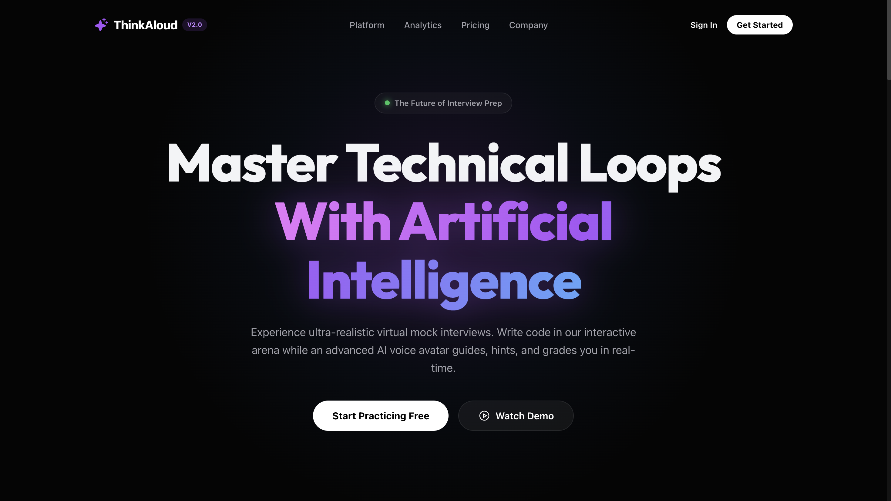
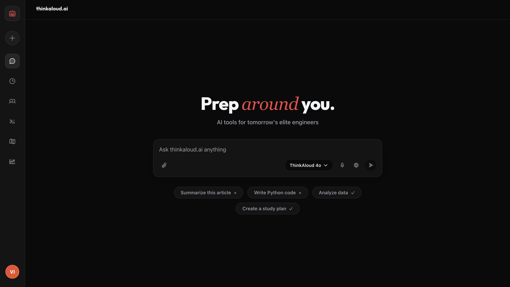
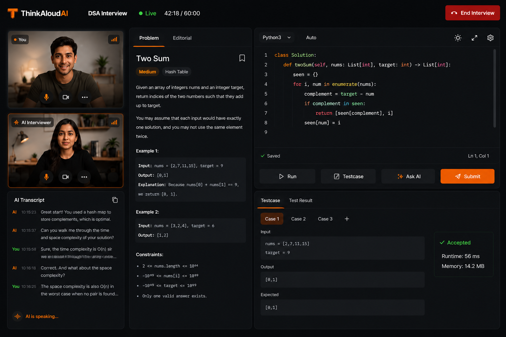

<h1 align="center">
  
</h1>

<h3 align="center">AI & Backend Developer · BTech CSE (AI) · Building products that think</h3>

<p align="center">
  <a href="https://linkedin.com/in/vishal-saini16"></a>
  <a href="mailto:vishalsaini160204@gmail.com"></a>
  <a href="https://github.com/vishal160204"></a>
</p>

<p align="center">
  
</p>

---

### 🚀 About Me

- 🔭 Building **AI-powered applications & distributed backend systems**
- 🌱 Deep-diving into **LLMs, RAG pipelines, Event-Driven Architecture & Cloud infra**
- 💡 Passionate about **Computer Graphics, AI Agents, and Real-time Apps**
- 🎯 Focused on building products that solve real user problems at scale
- ⚡ Fun fact: I optimize for **sub-1s chatbot TTFT** and **sub-2s voice latency**

---

### 🛠️ Tech Stack

#### 💻 Languages
<p align="left">

</p>

#### ⚙️ Backend & Frameworks
<p align="left">

</p>

#### 🗄️ Databases & Cloud
<p align="left">

</p>

#### 🤖 AI / ML
<p align="left">

</p>

#### 🔧 Tools & DevOps
<p align="left">

</p>

---

## 🏆 Featured Project

<h2 align="center">
  
</h2>

<p align="center">
  <em>AI-powered interview preparation platform for tomorrow's elite engineers</em>
</p>

<p align="center">
  
  
  
  
  
  
  
  
  
</p>

---

### 📸 Platform Screenshots

<table>
  <tr>
    <td align="center" width="50%">
      
      <br />
      <strong>🏠 Landing Page</strong>
      <br />
      <sub>Premium dark UI with luxury branding — "Master Technical Loops With AI"</sub>
    </td>
    <td align="center" width="50%">
      
      <br />
      <strong>💬 AI Chat Interface</strong>
      <br />
      <sub>ChatGPT-style AI assistant with study planning, code generation & data analysis</sub>
    </td>
  </tr>
  <tr>
    <td align="center" colspan="2">
      
      <br />
      <strong>🎙️ AI Interview Arena</strong>
      <br />
      <sub>Live coding environment with real-time AI voice interviewer, test execution & video feeds</sub>
    </td>
  </tr>
</table>

---

### 💡 What is ThinkAloud.ai?

ThinkAloud.ai is an **AI-powered interview preparation and learning platform** that helps software engineers and CS students practice technical interviews, behavioral rounds, system design discussions, and coding assessments through **real-time AI-driven voice interactions**.

The platform combines **distributed backend systems**, **event-driven architecture**, and **AI-powered voice agents** to deliver an interactive interview experience while continuously tracking user progress and learning outcomes.

---

### ✨ Key Features

| Feature | Description |
|---------|-------------|
| 🎙️ **AI Mock Interviews** | Real-time AI-powered interviews for DSA, System Design & Behavioral rounds |
| 🗣️ **Voice Conversations** | Natural voice interactions with AI interviewers via LiveKit WebRTC |
| 📊 **Smart Analytics** | Automated evaluation, skill scoring & personalized performance feedback |
| 💻 **Secure Code Runner** | Sandboxed coding environment for live DSA practice during interviews |
| 🗺️ **Learning Roadmaps** | AI-generated study plans with progress tracking |
| ⚡ **Low Latency** | Sub-1s chatbot TTFT · Sub-2s voice response latency |

---

### 🏗️ Architecture Overview

ThinkAloud follows a **distributed microservices architecture** with three independently deployable services communicating through **asynchronous events**.

```
┌─────────────────────────────────────────────────────────────────────┐
│                         ThinkAloud.ai Platform                      │
├──────────────────┬──────────────────────┬───────────────────────────┤
│   User Service   │    Main Service      │  AI Interviewer Service   │
│                  │                      │                           │
│  • Auth & JWT    │  • DSA Practice      │  • Realtime AI Interviews │
│  • User Profiles │  • Roadmaps          │  • Voice Agent (LiveKit)  │
│  • Skill Scoring │  • Dashboard/        │  • LangGraph Workflows    │
│  • Progress      │    Analytics         │  • Interview Grading      │
│    Tracking      │  • Secure Code       │  • Feedback Generation    │
│  • Event         │    Execution         │  • Transcript Analysis    │
│    Consumption   │  • Progress Viz      │                           │
├──────────────────┴──────────────────────┴───────────────────────────┤
│                    Redis Pub/Sub Event Bus                          │
├─────────────────────────────────────────────────────────────────────┤
│  PostgreSQL  │  Redis Cache  │  Amazon SQS  │  AWS Lambda           │
└─────────────────────────────────────────────────────────────────────┘
```

#### 🔄 Event-Driven Workflow

```
User completes interview → AI Service publishes InterviewCompleted event
                         → User Service consumes event
                         → Skills & history updated
                         → Analytics available on dashboard
```

> Services are **loosely coupled** via Redis Pub/Sub, enabling independent scaling and deployment.

---

### 🎯 Real-time AI Infrastructure

| Component | Technology | Purpose |
|-----------|-----------|---------|
| WebRTC Communication | **LiveKit** | Low-latency audio/video streaming |
| Interview Orchestration | **LangGraph** | Stateful multi-step interview workflows |
| Voice Detection | **VAD** | Real-time voice activity detection |
| Speech Synthesis | **Streaming TTS** | Natural AI voice responses |
| Interview Logic | **LLM + Tool Calling** | Context-aware reasoning & evaluation |

#### ⚡ Performance Targets
```
Chatbot TTFT ............. < 1 second
Voice Response Latency ... < 2 seconds
Interview Experience ..... Natural conversational flow
```

---

### ☁️ Infrastructure & Observability

**Deployed across AWS + Azure** with production-grade monitoring:

```
┌─ Compute ──────────────────────────────┐
│  AWS EC2  ·  Azure VM  ·  Docker       │
├─ Data ─────────────────────────────────┤
│  PostgreSQL  ·  Redis  ·  Amazon SQS   │
├─ Serverless ───────────────────────────┤
│  AWS Lambda (async tasks/notifications)│
├─ Monitoring ───────────────────────────┤
│  Datadog (infra/API)  ·  Opik (LLM)   │
└────────────────────────────────────────┘
```

---

### 🛠️ ThinkAloud Tech Stack

<table>
  <tr>
    <td><strong>Backend</strong></td>
    <td>FastAPI · SQLAlchemy · PostgreSQL · Redis · Celery</td>
  </tr>
  <tr>
    <td><strong>AI/ML</strong></td>
    <td>LangGraph · LangChain · LLM APIs · Whisper</td>
  </tr>
  <tr>
    <td><strong>Infrastructure</strong></td>
    <td>Docker · AWS (EC2, SQS, Lambda) · Azure VM</td>
  </tr>
  <tr>
    <td><strong>Realtime</strong></td>
    <td>LiveKit · WebRTC · VAD · Streaming TTS</td>
  </tr>
  <tr>
    <td><strong>Frontend</strong></td>
    <td>React · Vite · Glassmorphism UI · SVG Analytics</td>
  </tr>
  <tr>
    <td><strong>Observability</strong></td>
    <td>Datadog · Opik (LLM Tracing)</td>
  </tr>
</table>

---

### 🔮 Roadmap

- 🤖 Multi-agent interview simulations
- 📄 Resume-aware interview generation
- 🧠 Personalized learning recommendations
- 🏛️ Advanced system design interview support
- 👥 Team-based mock interview sessions
- 📚 AI-powered study planning

---

### 📊 GitHub Stats

<p align="center">
  
  
</p>

<p align="center">
  
</p>

---

<p align="center">
  <em>"The best way to predict the future is to build it — one project at a time."</em>
</p>

<p align="center">
  ⭐️ If you found my work interesting, consider giving a star!
</p>
